# Project 1: Design Journey

Be clear and concise in your writing. Bullets points are encouraged.

**Everything, including images, must be visible in Markdown Preview.** If it's not visible in Markdown Preview, then we won't grade it. We won't give you partial credit either. This is your warning.

## Existing Design, Planning, & Refined Design (Milestone 1)

### Existing Site: Target Audience I (Milestone 1)
> Existing site's target audience is anyone who wants to learn more about myself
> This includes friends and family members who want to see what I am doing in school, including extracurriculars as well as school projects.


### Existing Site: Target Audience I Needs (Milestone 1)
> Document your existing site's target audience's needs.
> List each need below. There is no specific number of needs required for this, but you need enough to do the job.

- Need #1: Updated image of myself
  - **Need**
    - A picture of myself that is up to date because they have not seen me in a really long time
  - **Design Choices**
    - The home page shows a big picture of myself
- Need #2: Information on projects
  - **Need**
    - Information of various projects I have worked on recently so they know what I have been working on in school
  - **Design Choices**
    - A page titled "Projects"
    - Headings that show the title of the project
    - A sub-heading for the location
    - Bullets to describe in more detail
    - Included a picture to show more of the story
- Need #3: Information on Work Experience
  - **Need**
    - Information of where I was working last since I have not been able to see them or tell them about it
  - **Design Choices**
    - A page titled "Work Experience"
    - Headings that show the position
    - A sub-heading for the location
    - Bullets to describe in more detail
    - Included a picture to show more of the story
- Need #4: Information on Clubs
  - **Need**
    - Information of clubs I have beena part of recently, along with the position held since I have not seen them recently and they are updated about my involvement
  - **Design Choices**
    - A page titled "Clubs"
    - Headings that show the title of the project
    - A sub-heading for the location
    - Bullets to describe in more detail
    - Included a picture to show more of the story


### Existing Site: Design/Sketches (Milestone 1)
> Sketch your existing site. Include these sketches here.
> DO NOT COPY SKETCHES FROM THE ORIGINAL ASSIGNMENT! Create new sketches here. This is part of the design process to get you thinking about the strengths/weaknesses of the current design.
> Provide a brief explanation _underneath_ each sketch.

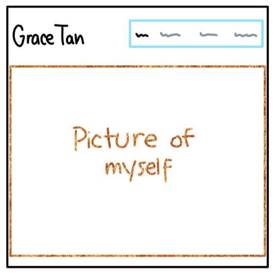

This is the home page and has a big picture of myself so the audience can see me clearly.  My name is to the top left since this is my website.  There is also the navigation bar in the top right and the section that we are currently on is a darker color.

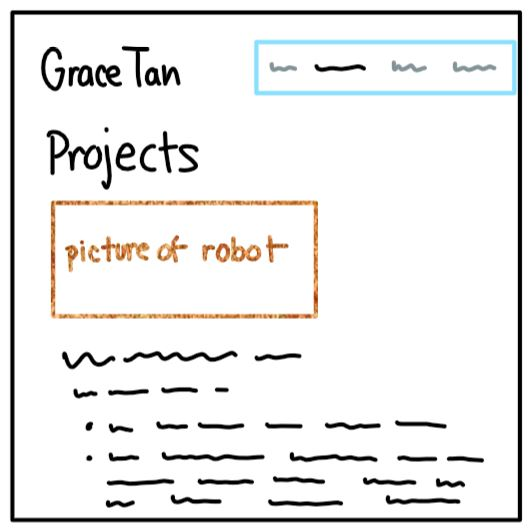

This is the project page and I have a picture of the robot, as that is the first project.  I also have have bolded headings for each of my projects, as well as bullet points underneath to describe them.  My name is to the top left since this is my website.  There is also the navigation bar in the top right and the section that we are currently on is a darker color.

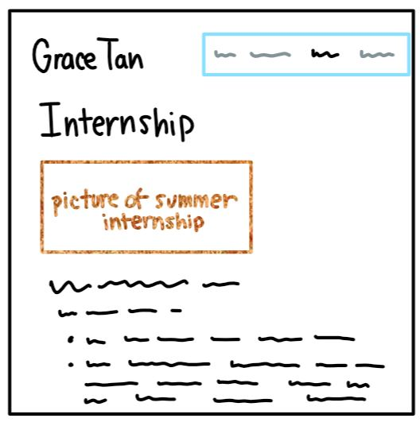

This is the internship page and I have a picture of the team I worked with this summer.  I also have have bolded headings for my position, as well as bullet points underneath to describe what I did.  My name is to the top left since this is my website.  There is also the navigation bar in the top right and the section that we are currently on is a darker color.

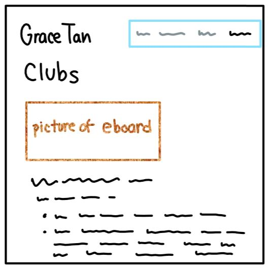

This is the clubs page and I have a picture of the various clubs I am a part of.  I also have have bolded headings for the clubs I am in, as well as bullet points underneath to describe what I did.  My name is to the top left since this is my website.  There is also the navigation bar in the top right and the section that we are currently on is a darker color.


### Refined Site: Target Audience II (Milestone 1)
> Company recruiters are my additional/secondary target audience.

### Refined Site: Target Audience II Needs (Milestone 1)
> Document target audience II's needs.
> List each need below. There is no specific number of needs required for this, but you need enough to do the job.

- Need #1: Technical Projects
  - **Need**
    - Technical Projects I have worked on so they know if I have enough experience for the position they might hire me for
    - Descriptions of the program or language I used for the project as that may have an impact on the projects I can work on for the company
  - **Design Ideas and Choices**
    - A page titled "Technical Experience"
    - Headings that show the title of the projects
    - A sub-heading for the location so it is clear if it is from Cornell or elsewhere
    - Bullets to describe in more detail so they know the skills I have
- Need #2: Professional Club Related to my Major
  - **Need**
    - Information on the position and clubs I am in that are related to my major, such as SWE (Society of Women Engineers) and IEEE (Institute of Electrical and Electronics Engineering)
  - **Design Ideas and Choices**
    - A page title "Leadership" to not only showcase the clubs I am in, but my leadership so recruiters know that I obtain these skills
    - Bullets to describe the events I have planned and to what scale
    - A picture of the SWE executive board so they know the faces I have worked with and might recognize a few of them from past events
- Need #3: Place to suggest business ideas
  - **Need**
    - Often times, I give my personal pitch to company recruiters, and many of them suggest pathways and ideas based on my interests and aspirations
    - Having a space for company recruiters to suggest business ideas with their contact information would allow me to connect with them and further that idea
  - **Design Ideas and Choices**
    - A form that will take in the company recruiter's first and last name, email address so I can reach them, and a space for them to put their business idea suggestion for me
    - The text to prompt these inputs will be in black and the header will be in dark purple
    - There will be validation in the same bright pink so it works well with the rest of the website and contrasts with the darker text that is in the rest of the form
    - There will be a submit button and a summary page after submission
- Need #4: Relevant Courses and Education Information
  - **Need**
    - Relevant courses I have taken so they can see if I would be an excellent fit for their company and position
    - Where I go to school so they know that I have gone to Cornell and I am used to the level of rigor
  - **Design Ideas and Choices**
    - A page titled "Education" 
    - A picture of Cornell's clock tower as that is a famous landmark
    - Separating courses form this semester with past semesters so recruiters know what I am recently studying and interested in
    - Courses will be in a list for better readability


### Refined Site: Content Organization/Navigation (Milestone 1)
> Identify the content that is necessary for both target audiences.
> List the content here.
> Don't forget to include the form.

- picture of myself
- bio of myself
- personal statement
- contact form of suggesting business ideas
- Cornell Major
- High School statistics
- Awards
- Relevant courses I have taken
- Internship experience
- Virtual Reality Project
- Robot Project
- Pipeline Processor Project
- Events Coordinator for AAIV (Asian American InterVarsity)
- Senior Corporate Director for SWE (SOciety of WOmen Engineers)
- Corporate Chair for IEEE (Institute of Electrical and Electronics Engineer)


> Organize the content for the target audience and identify possible pages for the content using card sorting.
> First, organize the content for target audience I. Document your card sorting by taking a photo and including it here.
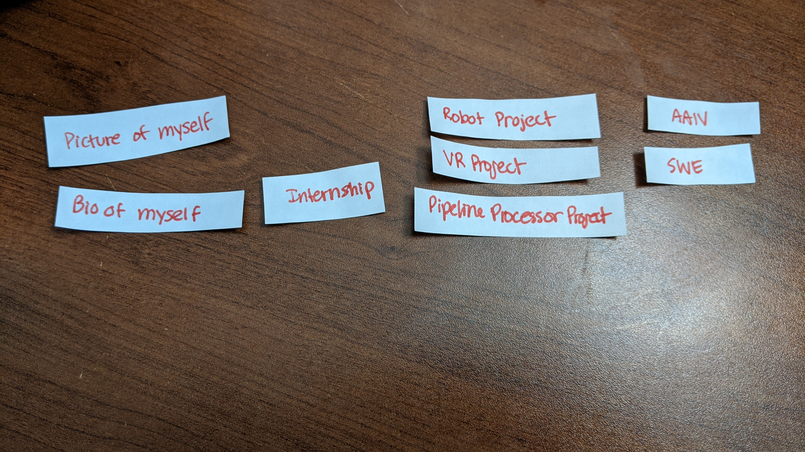

The pages from left to right would be About, Projects, Work Experience, and Clubs.

> Second, organize the content for target audience II. Document your card sorting by taking a photo and including it here.
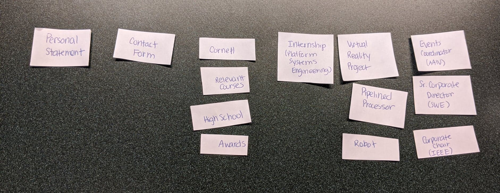

The pages form left to right would be About, Contact, Education, Internship, Projects, and Leadership.  Using Leadership instead of clubs is better as company recruiters will see the level of dedication and involvment.

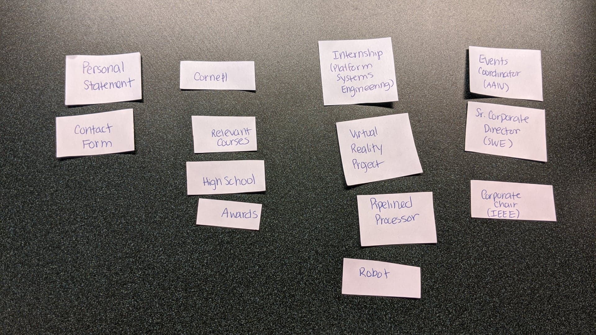

The pages form left to right would be About, Education, Techncial Experience, and Leadership.  About will also include the form, since the form is closely related to my mini bio under About, which is about suggesting business ideas as I explain how I want to start my own business.  Tehcnial Experience is better since that includes my intership experience and projects I have done, combining 2 pages since there might be too many pages.  All the pages are more balanced in terms of content compared to the last card sorting.

> Next, organize the content for both target audiences. Document your card sorting by taking a photo and including it here.
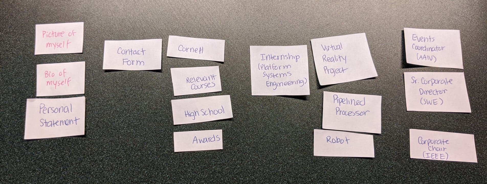

The pages form left to right would be About, Suggestions, Education, Internship, Techncial Experience, and Leadership.  This combines the pages from the existing site and the new site.

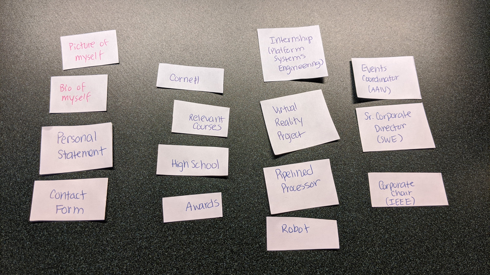

The pages form left to right would be About, Education, Techncial Experience, and Leadership.  The first page relates with each other as the form extends from the bio and personal statement, as well as the picture since it asks the audience if there are any business ideas they would suggest to me after reading my bio.  All technical experience on one page is better than splitting the content up.  Now, all the pages are more evenly distributed in terms of content.

> Lastly, list the pages that resulted from your final card sort (i.e. your site's navigation).
- Home
- Education
- Technical Experience
- Leadership


### Refined Site: Design (Milestone 1)
> Refine the design of your site to meet the needs of _both_ target audiences.
> Include sketches of each page of the refined design.
> Provide a brief explanation _underneath_ each sketch.
> Document your _entire_ design process. **Show your preliminary sketches and your final sketches.**
> Don't forget the form and confirmation page!

#### First Design
Changes in the overall design:
- Make the top left with my name a dark purple so it is not just black and unappeaing
- Make top right nav bar also dark purple with white text, separating each page with boxes
- Highlight each box with light purple when mouse hovers above it
- Include big headings on each page

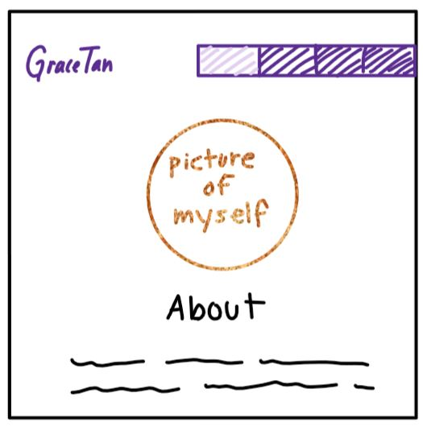

This is the home page and it no longer has a big picture of myself since this would discourage less content and there would be no room for the bio.  Instead, there is a circular picture of myself and the bio is underneath.  

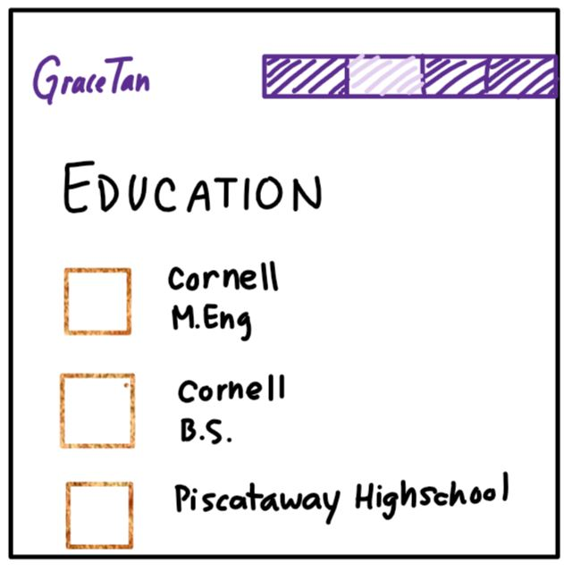

This is the project page and I have a pictures that represent each institution or degree I am obtaining.  This will make sure the block of text does not extend for the entire rest of the page.

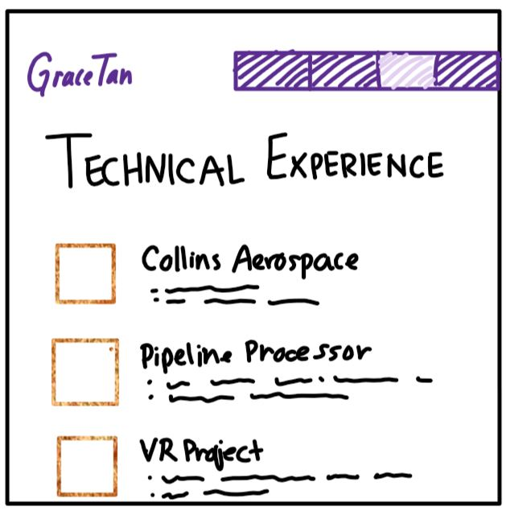

This is the project page and I have a picture of the team I worked with this summer, as well as pictures for different projects.  This will make sure the block of text does not extend for the entire rest of the page and the audience viewing this will get a better idea of mu project.

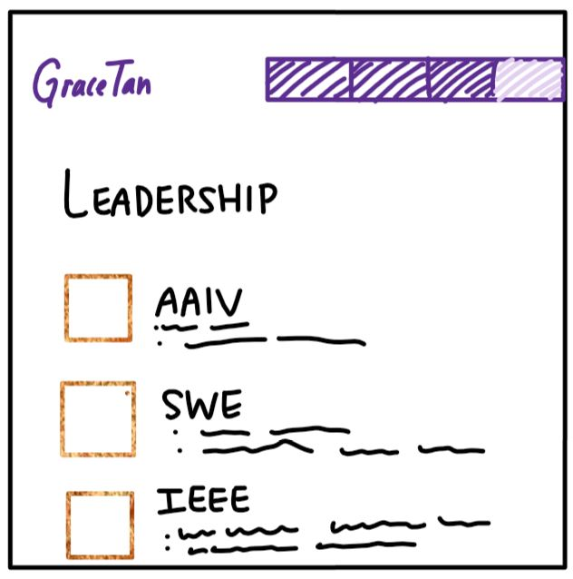

This is the project page and I have a picture of the various clubs I am a part of.  The audience will get a better idea of each club with the visuals and this will ensure that the block of text text does not extend for the entire rest of the page.

#### Second and Final Design
Changes in the overall design:
- Top bar is one continuous dark purple color so everything does not seem as disjointed
- Top left is not only my name but also a profile picture of myself in a circle
- The bigger pictures on each page are situated on the top left to give the site a more balanced feel as my smaller circular profile picture is already on the top left of the page
- Top right is the nav bar and contains each of the headings with a white box around it when on the page, and a pink box around it if the mouse is hovered over the next one.  Due to this, there is no more large heading on every single page as it seems unnecesary
- Bigger headings are in the dark purple color and the subheadings are in a pink.  Both these colors are the same as the nav bar.  The text is just black
- Bottom bar for footer is also a continuous dark purple color


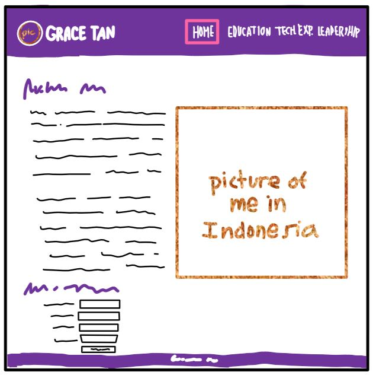

This is the home page and has a big picture of myself to the right so the audience can see me clearly.  The bio and personal statement are situated to the left of the picture of me in Indonesia, since i discuss that in the bio.  The form underneath prompts the audience to suggest any business ideas after they have read about my own aspirations with becoming an entrepreneur.

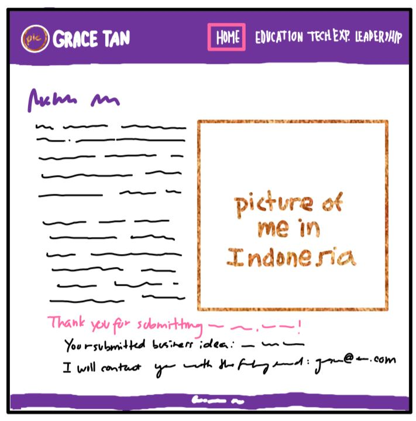

This shows the home page with the summary page after the form is submitted.  It will thank the user who submitted and show the user the business idea submitted, as well as the email inputed and inform that I will contact the user with the given email address.  I also created the heading pink so that it sticks out more, since everything else on the page is dark purple or black.

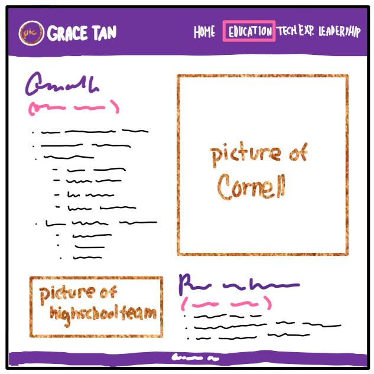

This is the education page and I have a picture of Cornell in the left as the description of my major and relevant courses is on the right.  This is in bullet form so that the classes are not as cluttered and it is easier to read.  The next picture is from my high school and I let go of my old design because the squares on each page would limit the pictures I can choose as well as visibility, since this picture in a square would be extremely tiny an cropped.

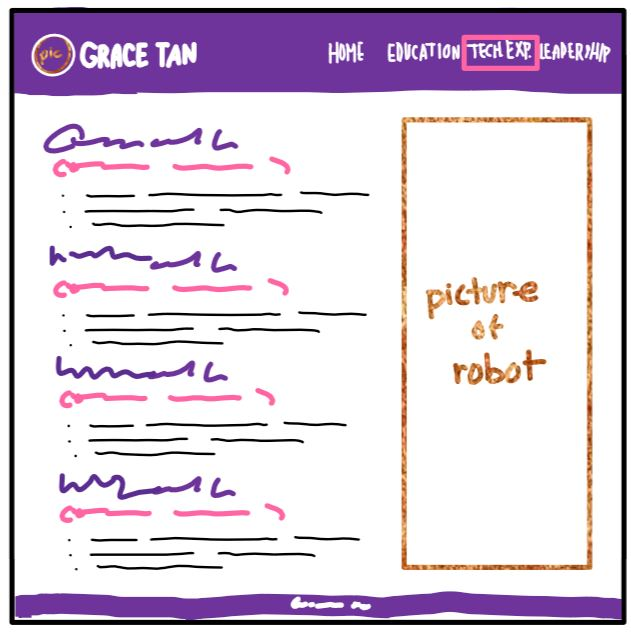

This is the technical experience page and I have a picture of the robot I worked on in the right side.  On the left are each of the experiencees that showcase my technical skill in the form of bullets.  I decided to not have small squares for every single project, since some of my projects were more coding based, such as the pipelined processor, and there was no object to really represent my work.  The layout would also be pretty synonymous to the other pages and may be too redundant.

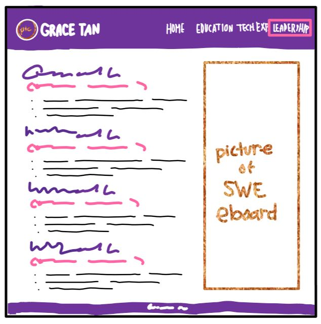

This is the leadership page and I have a picture of the executive board I worked with for SWE.  To the right are the clubs I have held possitions for and are listed in bullet form.  This picture was selected as it is vertical and the colors go well with the website.

### Partial Plan (Milestone 1)
> Using your refined sketches, plan your site's partials.
> You may describe each partial or sketch it. It's up to you!
- I would need a partial for the navigation bar for the header
- I would need a partial for the footer

---

## Sticky Form Planning (Milestone 2)

### Sticky Form (Milestone 2)
> What controls do you need for your form?
- First Name
- Last Name
- Email Address
- Suggested Business Idea

> Plan out your feedback messages for your form. You may sketch (probably the easiest) or write it out.
These will be be in pink.
- First Name: Please provide a first name.
- First Name: Please provide a last name.
- Email Address: Please provide an email.
- Suggested Business Idea: Please provide a business idea.

> How does this form meet the needs of at least one of your target audiences (specify which)?
- For company recruiters who want to contact me directly, they can fill out the form and I can contact them with the email they provide.  This is because when I meet company recruiters, they often want to talk to me about various pathways I can go with business given my aspoirations and technical background.  This form will enable them to specify any business ideas they have and I can contact them accordingly to followup.

### Validation Code Plan (Milestone 2)
> Write out your pseudocode plan for handling the validation of the form.

```
//Make a variable for each of the inputs and sanitize

//Need variable to get the input for first name and see if it is a string
if(empty) print out feedback message

//Need variable to get the input for last name and see if it is a string
if(empty) print out feedback message

//Need variable to get the input for email and see if it is an email
if(empty) print out feedback message

//Need variable to get the input for business suggestion and see if it is a string
if(empty) print out feedback message

```
---

## Complete & Polished Website (Final Submission)

### Target Audiences (Final Submission)
> Tell us how your final site meets the needs of the target audiences. Be specific here. Tell us how you tailored your design, content, etc. to make your website usable by both target audiences.


### Additional Design Justifications (Final Submission)
> If you feel like you haven’t fully explained your design choices in the final submission, or you want to explain some functions in your site (e.g., if you feel like you make a special design choice which might not meet the final requirement), you can use the additional design justifications to justify your design choices. Remember, this is place for you to justify your design choices which you haven’t covered in the design journey. You don’t need to fill out this section if you think all design choices have been well explained in the design journey.


### Self-Reflection (Final Submission)
> Reflect on what you learned during this assignment. How have you improved from 1300? What things did you have trouble with?

I have definitely improved from 1300 with design as I have been varying my layout of pictures, and just the use of pictures in general.  I used to struggle with the size and quantity of having too little or too few.  I also am getting better at layout and putting content that is relevant and goes well together on each page.  I am proud of the final website I've made since the colors go well together, and it is not just boring.  I was scared of using a brighter pink, but I see that this accent color goes pretty nicely.
